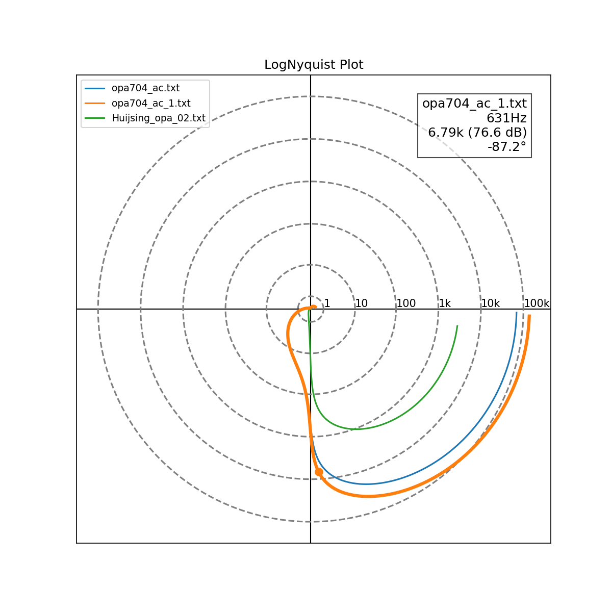

# LogNyquist

*[日本語版はこちら](READMEj.md)*



A tool for drawing a **log-scale Nyquist plot** from LTspice AC analysis results (Bode-style text export).

A conventional Nyquist plot can span a huge range of magnitudes, making it hard to see both the region near the origin (around -1+j0, which matters most for stability judgment) and the high-magnitude region in the same chart. This tool transforms the magnitude to `log10(|G| + 1)` before plotting in polar coordinates, so both the fine detail near the origin and the wide dynamic range stay visible in one figure.

## Input data format

The input is expected to be a text export of an LTspice AC analysis (e.g. via "Copy data to Clipboard"), containing frequency and complex gain in (dB, deg) form.

```
Freq.	V(vout)/(-V(vn))
1.00000000000000e+00	(9.67672261552728e+01dB,-9.85573394407573e-01°)
1.04712854805090e+00	(9.67671022101713e+01dB,-1.03201222012226e+00°)
...
```

- Column 1: frequency [Hz]
- Column 2: complex gain in `(magnitude[dB],phase[deg]°)` form

Sample files `opa704_ac.txt`, `opa704_ac_1.txt`, and `Huijsing_opa_02.txt` are included.

## Usage

```bash
python LogNyqist.py file1.txt [file2.txt] [file3.txt]
```

- Up to 3 files can be loaded and compared at once.
- If no command-line arguments are given, you'll be prompted interactively for 1 to 3 file names (press Enter on an empty line to stop after the first).

### Controls

| Action | Effect |
| --- | --- |
| Mouse hover | Shows the frequency, magnitude (linear/dB), and phase at the nearest point on any curve. The corresponding curve is highlighted with a thicker line, and its source file name is shown |
| Mouse wheel | Zoom in/out around the origin (grid circles are added automatically as you zoom in) |
| `P` key | Save the current view as a timestamped PNG file |

When multiple files are loaded, each curve is color-coded and labeled by file name in the legend (top-left).

## Requirements

- numpy
- matplotlib

```bash
pip install numpy matplotlib
```
